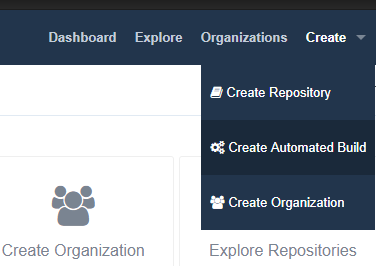
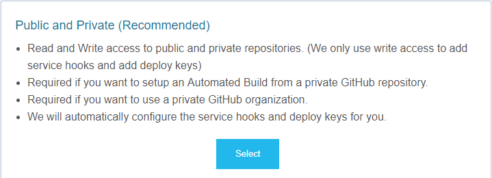
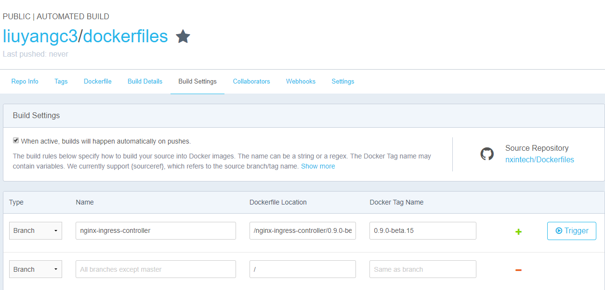
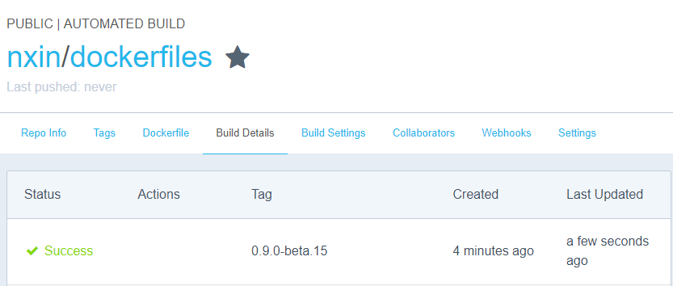

# Dockerfiles
Dockerfile that from gcr.io, build on DockerHub

docker repo https://hub.docker.com/r/nxin/dockerfiles/

# how to
login docker hub https://hub.docker.com

click `Create` `Create Automated Build`

(optional) if your account not link to GitHub, link GitHub first,
choose `Public and Private (Recommended)`

select this repo, click `Create Auto-build Github`

`trigger` a build, and `save changes`

see result in `Build Details`

more detail see https://docs.docker.com/docker-hub/builds/